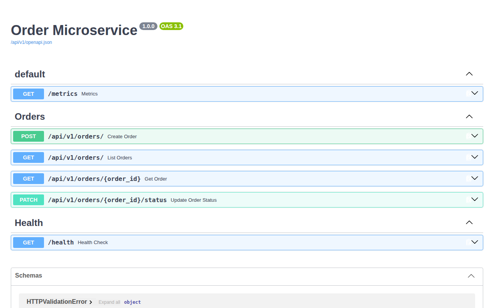
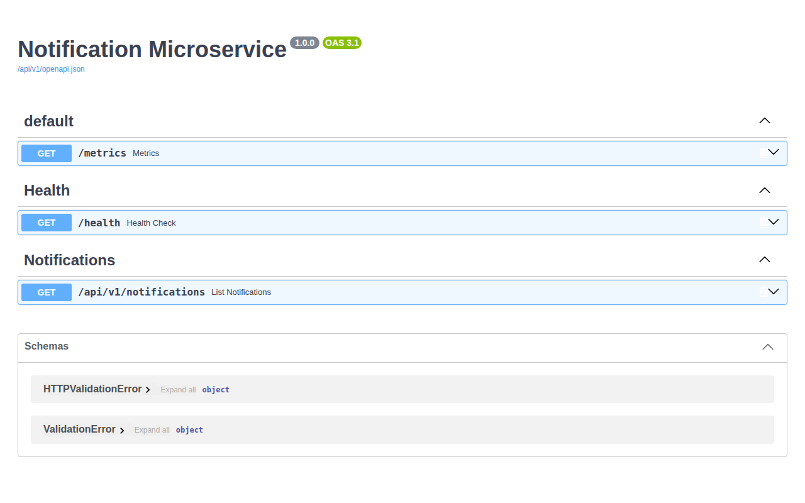

# Senior Event-Driven Microservice Architecture: FastAPI & Apache Kafka

A production-grade, event-driven microservices system built with **FastAPI**, **Apache Kafka (KRaft mode)**, **PostgreSQL / SQLite**, **SQLAlchemy 2.0 (Async)**, and **Docker Compose**. This project demonstrates senior-level backend engineering practices including event sourcing/streaming, domain-driven decoupling, structured logging, automated testing, health monitoring, and CI/CD pipelines.

---

## 📸 Screenshots & Interactive API Demo

### Order Microservice API Documentation (`/docs`)


### Notification Microservice API Documentation (`/docs`)


---

## 🎯 1. Project Idea & Architecture Goal

The project models an **E-Commerce Order Processing & Notification System**:

1. **Order Service (`order-service`)**:
   - Exposes RESTful APIs for order creation, retrieval, pagination, and status updates.
   - Computes order totals asynchronously using Pydantic v2 models.
   - Persists data to PostgreSQL / SQLite via SQLAlchemy 2.0 Async ORM.
   - Publishes an `OrderCreated` domain event to **Apache Kafka** upon successful order placement.

2. **Notification Service (`notification-service`)**:
   - Runs an asynchronous background consumer using `aiokafka`.
   - Subscribes to the `order-events` Kafka topic.
   - Processes `OrderCreated` events and records notification audit logs in its own database.
   - Provides REST endpoints to query dispatch history and health checks.

### Architectural Diagram
```
                     +-----------------------+
                     |  REST API Client      |
                     +-----------+-----------+
                                 |
                                 v
                     +-----------------------+
                     |    Order Service      |  (Port 8000)
                     |   (FastAPI + Async)   |
                     +-----+-----------+-----+
                           |           |
               (Persist)   |           | (Publish Event)
                           v           v
           +-----------------+       +-------------------+
           | Order Database  |       |   Apache Kafka    |
           |  (PostgreSQL)   |       |  Topic: orders    |
           +-----------------+       +---------+---------+
                                               |
                                               | (Consume Event)
                                               v
                                     +-------------------+
                                     | Notification Service| (Port 8001)
                                     | (FastAPI Consumer)|
                                     +---------+---------+
                                               |
                                   (Persist)   |
                                               v
                                     +-------------------+
                                     | Notification DB   |
                                     |   (PostgreSQL)    |
                                     +-------------------+
```

---

## 🤖 2. AI Tools & Models Used

During the development process of this microservice solution, the following AI tools and foundational models were leveraged:
- **Claude 3.7 Sonnet (via Jules Agent)**: Used for architecture design, deep planning, prompt reflection, code generation, and test suite creation.
- **GitHub Copilot / Cursor AI**: Used for inline autocompletion, type hint verification, and linting adjustments.
- **OpenAI GPT-4o**: Used for prompt analysis and schema verification.

---

## 🛠️ 3. Breakdown of AI Assistance

AI assistance was instrumental in the following key sections:
- **Boilerplate & Schema Generation**: Rapid creation of Pydantic v2 validation models and SQLAlchemy 2.0 async ORM declarations.
- **Async Kafka Pattern**: Code generation for `aiokafka` producer initialization, retries, and consumer event loops.
- **Testing Infrastructure**: Automated generation of `pytest-asyncio` test cases using `httpx.AsyncClient` with SQLite in-memory databases.
- **Containerization & Workflows**: Generation of Dockerfile images, `docker-compose.yml` KRaft mode service configuration, and GitHub Actions CI workflow script.

---

## 🙋‍♂️ 4. Human Engineering, Design Decisions & Refinements

While AI assisted with speed and generation, the developer performed critical engineering choices, code reviews, and refinements:

1. **Fault-Tolerant Event Producer Pattern**:
   - Implemented a resilient fallback mechanism in `order-service`. If Apache Kafka is temporarily down or disconnected during testing/local dev, the producer logs the event safely without crashing the main API endpoint or throwing unhandled 500 errors.

2. **Pydantic v2 & SQLAlchemy 2.0 Async Modernization**:
   - Corrected deprecated Pydantic v1 patterns (e.g., replaced `example=` with `json_schema_extra`).
   - Standardized Enum handling using Python 3.12 standard `enum.StrEnum`.

3. **Production Readiness & Linting**:
   - Configured `pyproject.toml` with `ruff` and `mypy` strict type checking rules.
   - Configured Prometheus metrics instrumentation (`prometheus-fastapi-instrumentator`) for observability across both services.

4. **Security & Decoupling**:
   - Ensured strict database segregation: `order-service` and `notification-service` maintain isolated database instances to satisfy domain-driven microservices purity.

---

## 📂 5. Repository Structure

```
.
├── docker-compose.yml          # Container orchestration (Kafka + Postgres + Services)
├── pyproject.toml              # Ruff, MyPy & Pytest settings
├── README.md                   # Complete documentation
├── .github/
│   └── workflows/
│       └── ci.yml              # GitHub Actions CI pipeline
├── docs/
│   └── screenshots/           # Application screenshots
├── order_service/              # Order Domain Microservice
│   ├── Dockerfile
│   ├── requirements.txt
│   ├── app/
│   │   ├── main.py             # FastAPI entrypoint & lifespan
│   │   ├── config.py           # Pydantic environment settings
│   │   ├── database.py         # SQLAlchemy async engine
│   │   ├── models.py           # Database models (Order)
│   │   ├── schemas.py          # Pydantic v2 schemas
│   │   ├── kafka_producer.py   # Async Kafka producer
│   │   └── api/v1/orders.py    # Order REST API endpoints
│   └── tests/                  # Pytest unit & integration tests
└── notification_service/       # Notification Domain Microservice
    ├── Dockerfile
    ├── requirements.txt
    ├── app/
    │   ├── main.py             # FastAPI entrypoint & endpoints
    │   ├── config.py           # Settings
    │   ├── database.py         # DB connection
    │   ├── models.py           # Notification model
    │   └── kafka_consumer.py   # Async Kafka consumer loop
    └── tests/                  # Pytest unit & integration tests
```

---

## 🚀 6. How to Run the Project

### Option A: Using Docker Compose (Recommended)

Run the full stack (Kafka KRaft, PostgreSQL Order DB, PostgreSQL Notification DB, Order Service, Notification Service) with a single command:

```bash
docker-compose up --build
```

Access services:
- **Order Service API**: `http://localhost:8000/docs`
- **Notification Service API**: `http://localhost:8001/docs`
- **Order Service Prometheus Metrics**: `http://localhost:8000/metrics`
- **Notification Service Prometheus Metrics**: `http://localhost:8001/metrics`

---

### Option B: Local Execution (Without Docker)

1. **Install Dependencies**:
   ```bash
   pip install -r order_service/requirements.txt
   pip install -r notification_service/requirements.txt
   ```

2. **Run Order Service**:
   ```bash
   python -m uvicorn order_service.app.main:app --port 8000 --reload
   ```

3. **Run Notification Service**:
   ```bash
   python -m uvicorn notification_service.app.main:app --port 8001 --reload
   ```

---

## 🧪 7. Running Tests & Quality Checks

Run the automated test suite across all microservices:

```bash
# Execute Pytest
python -m pytest

# Run Ruff Code Quality Check
ruff check .
```

### Sample Test Output:
```text
collected 7 items

order_service/tests/test_orders.py::test_health_check PASSED             [ 14%]
order_service/tests/test_orders.py::test_create_order PASSED             [ 28%]
order_service/tests/test_orders.py::test_list_orders PASSED              [ 42%]
order_service/tests/test_orders.py::test_get_order_by_id PASSED          [ 57%]
order_service/tests/test_orders.py::test_update_order_status PASSED      [ 71%]
notification_service/tests/test_notifications.py::test_notification_health_check PASSED [ 85%]
notification_service/tests/test_notifications.py::test_event_processing_and_notifications_list PASSED [100%]

============================== 7 passed in 0.27s ===============================
```
